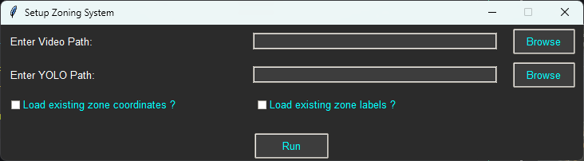
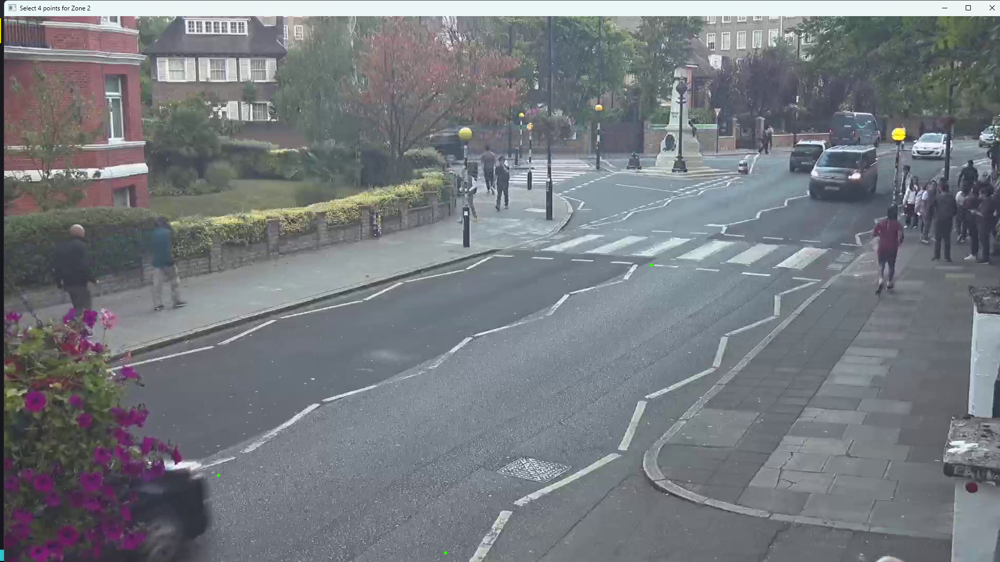
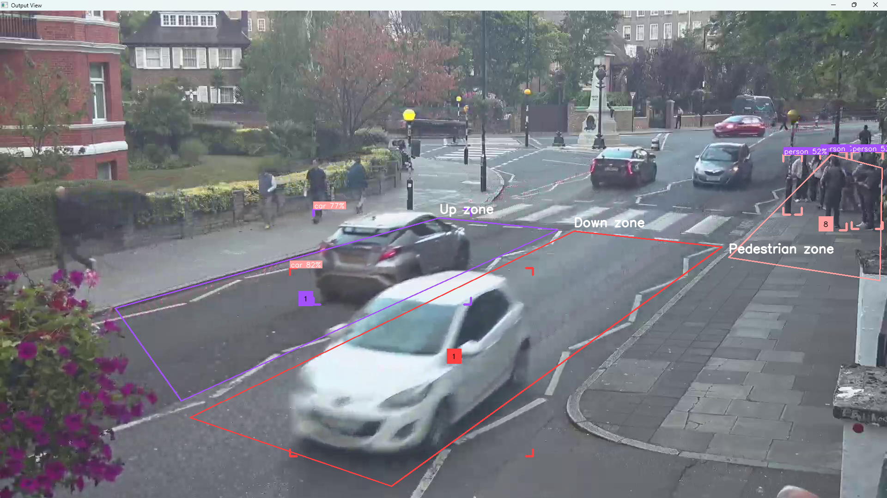

<h1 align="center">Traffic Control with Vehicle and Pedestrian Tracker</h1>

## About the Project:
> This project is a part of my Final Year Project at University,  
> on the topic of Improving current Traffic systems using Cloud  
> and Edge Computing & High-Performance Computing.

> This portion of the project is a real-time vehicle and pedestrian  
> tracker that uses advanced computer vision techniques to count and  
> track vehicles and pedestrians in a specific zone/area.
> It then compares the realtime count of Vehicles and Pedestrians on the road and decides whether to change the traffic light or not.

## How it Works:

| Feature | Description |
|---------|-------------|
|  | GUI provided to input one-time details necessary to run the detection model. Enter a Video Path or your Webcam |
|  | Select points for creating your zones. |
|  | Output Window, displaying in RealTime |

## What does it accomplish?
>
> - The project aims to develop a real-time system for counting and tracking vehicles and pedestrians in a specific area using advanced computer vision techniques. 
>
> - The primary goal is to improve traffic management and safety by providing accurate data on the flow of vehicles and pedestrians and being able to safely manipulate the traffic flow dynamically. 
>
> - This system will leverage a combination of edge computing, cloud resources, and high-performance computing (HPC) to process and analyze video feeds in real-time.
 

## How to run this?
> - Clone the repo to your local machine.
>
> - Create a virtual environment using `python -m venv venv`
>
> - Activate the virtual environment using `.\venv\Scripts\activate`
>
> - Install the required packages using `pip install -r requirements.txt` as given.
>
> - **[NOTE]** Additionally, to utilize your GPU, you will need to separately install `torch-2.4.0+cu121`, `torchvision-0.19.0+cu121` and `torchaudio-2.4.0+cu121` from the PyTorch website!
>
> - Once that's done, simply run the `main.py` file using `python main.py` and you're good to go!

## LICENSE:
>
> This project is licensed under the GNU General Public License Version 3 - see the [LICENSE](./LICENSE) file for details.
>
> Additionally, this project uses the YOLOv8 model, which is licensed under the AGPL-3.0 license.
>
> Also, this project uses the Supervision library, which is licensed under the MIT license. This makes the Supervision part of the code fully open source and freely usable in your own projects.
